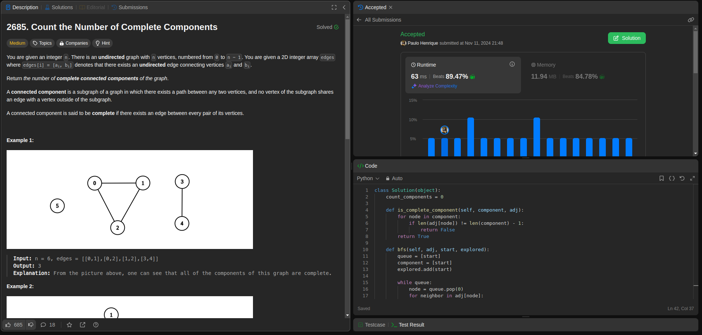
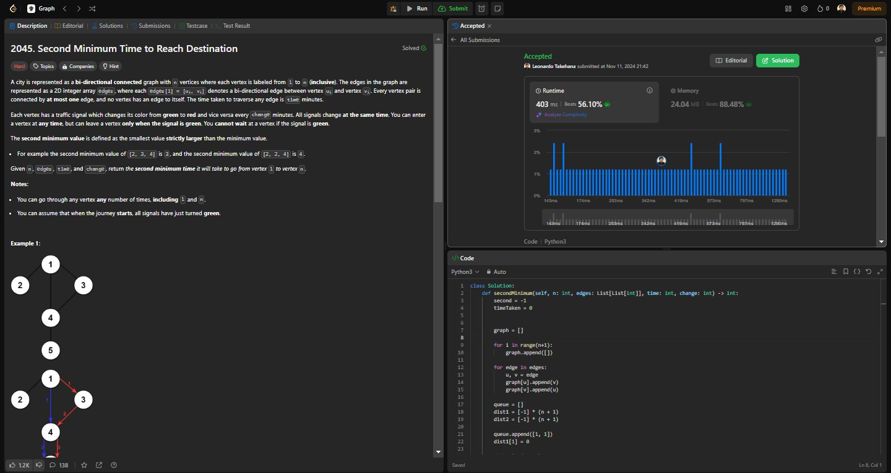
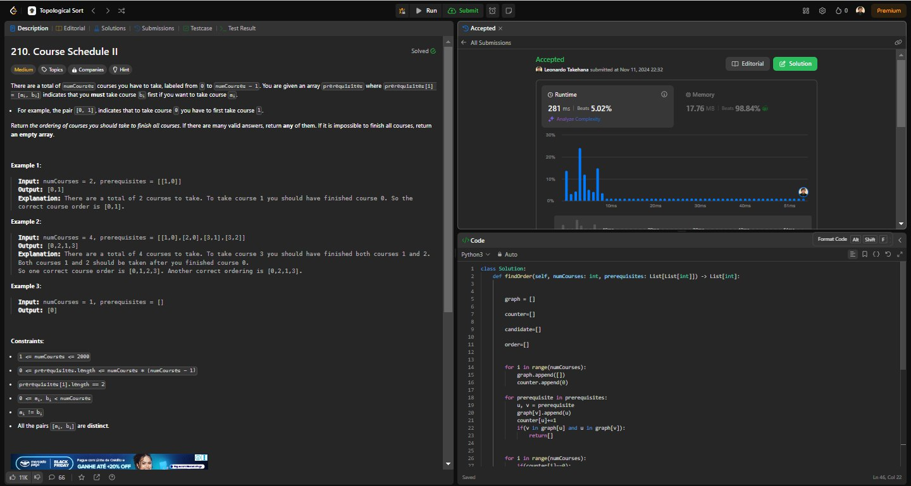

Temas:
 - Grafos1
 
# Grafos1_LeetCodeGrafos1

**Número da Lista**: 10<br>
**Conteúdo da Disciplina**: Grafos 1<br>

## Alunos
|Matrícula | Aluno |
| -- | -- |
| 19/0094257  |  Paulo Henrique de O. Rezende |
| 23/2022952  |  Leonardo de Souza Takehana |

## Sobre 
O projeto é contemplado por resolver 3 questões da plataforma LeetCode, sendo 2 dífíceis e 1 médio. A definição de médio, fácil e difícil é definido pela própria plataforma.

Para os exercícios serem realizados, usamos o algorito de busca em profundidade e busca em largura com pequenas modificações, para que pudessem receber o Accept como solução para o desafio.

As questões foram escolhidas com base nos algoritmos DFS e BFS, permitindo o grupo focar apenas nos algoritmos analisados em aula com mínimas adaptações.

## Screenshots
Questão: [Difícil - 834. Sum of Distances in Tree](https://leetcode.com/problems/sum-of-distances-in-tree/?envType=problem-list-v2&envId=graph)


Questão: [Médio - 2685. Count the Number of Complete Components](https://leetcode.com/problems/count-the-number-of-complete-components/description/?envType=problem-list-v2&envId=graph)


Questão: [Difícil - 2045. Second Minimum Time to Reach Destination](https://leetcode.com/problems/second-minimum-time-to-reach-destination/description/?envType=problem-list-v2&envId=graph)


Questão: [Médio - 210. Course Schedule II](https://leetcode.com/problems/course-schedule-ii/description/?envType=problem-list-v2&envId=topological-sort)



## Instalação 
**Linguagem**: python<br>
**Framework**: Não será preciso<br>
Instalar uma versão lastest stable do python desde de que seja > 3.11.  

## Uso 
Para rodar este projeto, basta entrar na raiz do projeto e executar o arquivo referente a questão que se deseja avaliar, por exemplo:
```
python3 834.SumofDistancesinTree.py
```

